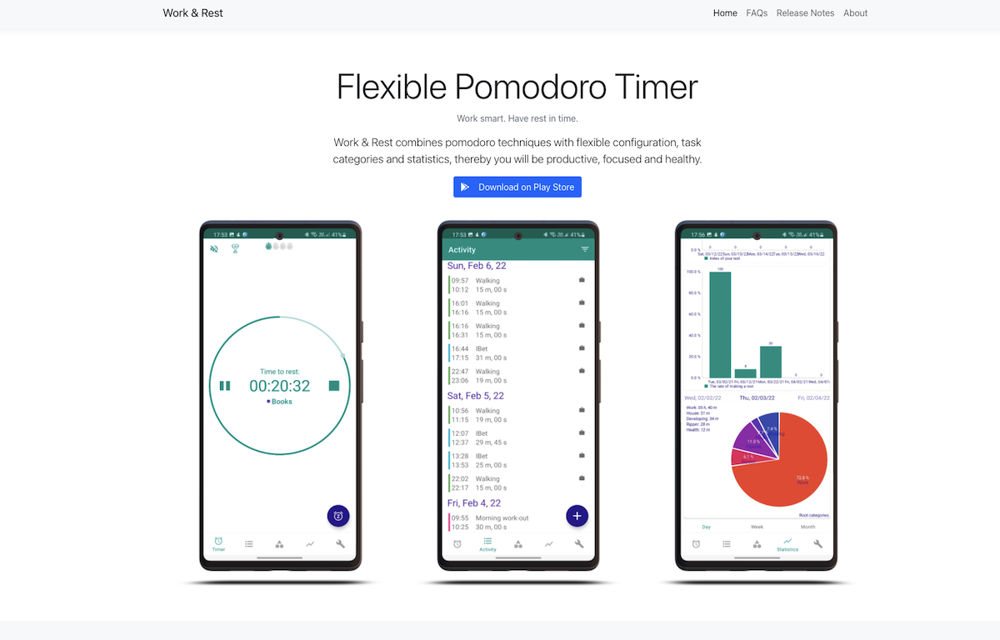

# Work & Rest - Flexible Pomodoro Timer: App Website

### See: [pomodoro-timer.space](https://pomodoro-timer.space)



Work & Rest mobile application website created with [React](https://reactjs.org/)
, [Bootstrap](https://react-bootstrap.github.io/), [TypeScript](https://www.typescriptlang.org/), based
on [create-react-app](https://github.com/facebook/create-react-app). \
Deployed as docker-compose, image contains react-site, nginx and certbot with auto-renewal cert.

## Local developing

Developing like a general react app.

Clone repository and run for install packages:

```
npm install
```

Runs the app in the development mode:

```
npm start
```

Open [http://localhost:3000](http://localhost:3000) to view it in the browser.

The page will reload if you make edits.\
You will also see any lint errors in the console.

## Build & Deploy

> It was convenient for me to run the application in docker. \
> So 'build and deploy' based on docker deployment.

### Build

GitHub workflow actions [./github/docker-image.yml](/.github/workflows/docker-image.yml) build final site docker image
based on [Dockerfile](Dockerfile).

Image contains react app (copied to nginx site directory `/var/www/wrpomodoro`), nginx + certbot with auto-renewal cert.

Docker image pushed to docker hub.

### Deploy

All you need to deploy site via docker located in [docker folder](/docker).

[wr-site.yml](/docker/wr-site.yml) - docker compose file with site image tag

[nginx-certbot.env](/docker/nginx-certbot.env) - certbot config file. Please learn more
about [docker-nginx-certbot](https://github.com/JonasAlfredsson/docker-nginx-certbot). Very recommend
read [Good to Know nginx-certbot](https://github.com/JonasAlfredsson/docker-nginx-certbot/blob/master/docs/good_to_know.md)
docs before using image.

[server.conf](/docker/nginx/user_conf.d/server.conf) - nginx config

:warning: [Docker deployment folder](/docker) contains 'Work & Rest' project specific configs, like:
* image tag on [wr-site.yml](/docker/wr-site.yml)
* email on [nginx-certbot.env](/docker/nginx-certbot.env)
* server_name, path to site on [nginx-certbot.env](/docker/nginx-certbot.env)

---
Also, you can deploy react app as you want. See the section
about [deployment](https://facebook.github.io/create-react-app/docs/deployment) for more information.

### Result

One-command `docker-compose -f wr-site.yml up -d` site deployment with auto-renewal certificate.

## Learn More About React App

You can learn more in
the [Create React App documentation](https://facebook.github.io/create-react-app/docs/getting-started).

To learn React, check out the [React documentation](https://reactjs.org/).
